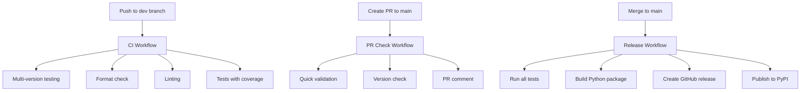

# GitHub Actions Workflows

This directory contains the GitHub Actions workflows configured for the Ticket Please project, following the technical specifications defined in `docs/tech-specs.md`.

## Configured Workflows

### 1. CI Workflow (`ci.yml`)

**Trigger:** Push to development branches (all except `main`) and Pull Requests to `main`

**Purpose:** Continuous validation of code in development branches

**Features:**
- Runs on multiple Python versions (3.10, 3.11, 3.12, 3.13)
- Uses caching to optimize execution times
- Validates code formatting with `ruff format --check`
- Runs linting with `ruff check`
- Executes tests with coverage using `pytest`
- Uploads coverage report to Codecov

### 2. PR Check Workflow (`pr-check.yml`)

**Trigger:** Pull Requests to `main` (opened, synchronize, reopened)

**Purpose:** Fast and specific validation for Pull Requests

**Features:**
- Runs only on Python 3.11 for faster execution
- Uses caching to optimize times
- Validates code formatting and linting
- Runs basic tests
- Checks if version was updated in the PR
- Automatically comments on PR about version status

### 3. Release Workflow (`release.yml`)

**Trigger:** Push to `main` branch

**Purpose:** Automatic package building and publishing to PyPI

**Features:**
- **Test Job:** Runs all validations before building
- **Build Job:** Builds Python package (wheel and source distribution)
- **Release Job:**
  - Extracts version from `pyproject.toml`
  - Checks if tag already exists
  - Creates GitHub release only for new versions
  - Publishes package to PyPI
  - Attaches wheel and source distribution to the release

## Distribution

The package is distributed as a Python package through PyPI:

| Package Type | Description | Installation |
|--------------|-------------|--------------|
| Wheel | Binary distribution | `pip install ticketplease` |
| Source | Source distribution | `pip install ticketplease --no-binary=ticketplease` |

## Tools Used

- **Poetry:** Dependency management, virtual environment, and package building
- **Ruff:** Code formatting and linting
- **Pytest:** Testing framework with coverage
- **PyPI:** Package distribution platform
- **GitHub Actions:** CI/CD automation

## Workflow Flow

## Release Process

1. **Development:** Work on feature branches
2. **Validation:** CI workflow validates each push
3. **Pull Request:** PR Check workflow validates the PR
4. **Version Update:** Update version in `pyproject.toml` if needed
5. **Merge:** Merge PR to main triggers release workflow
6. **Release:** Automatic creation of GitHub release and PyPI publication

## Configuration

All workflows are configured to:
- Use the latest stable versions of actions
- Cache dependencies for faster execution
- Fail fast on errors
- Provide detailed logs and feedback
- Follow security best practices

## Maintenance

- Workflows use pinned action versions for security
- Dependencies are managed through Poetry
- Python versions are kept up to date with project requirements
- Runners are updated to latest available versions
